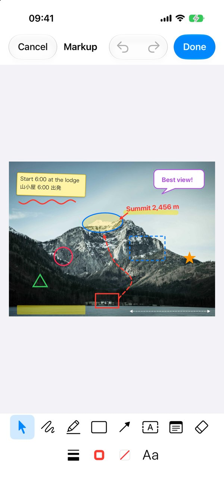
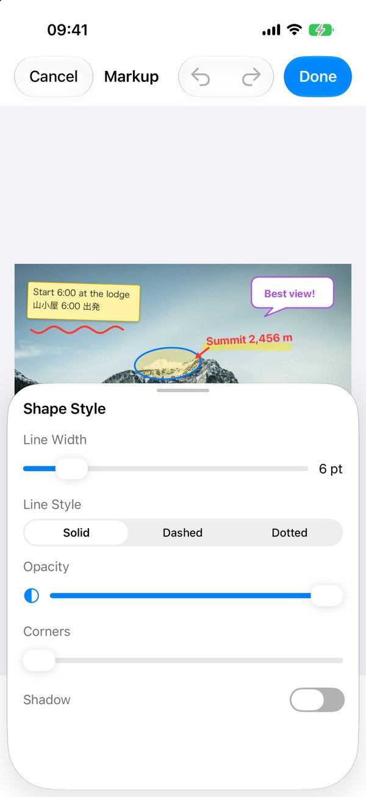
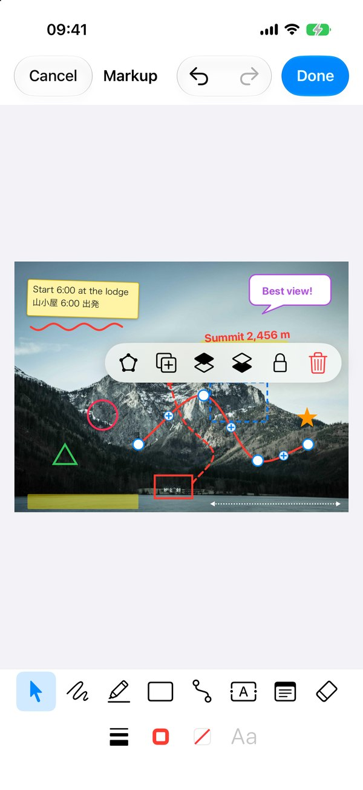
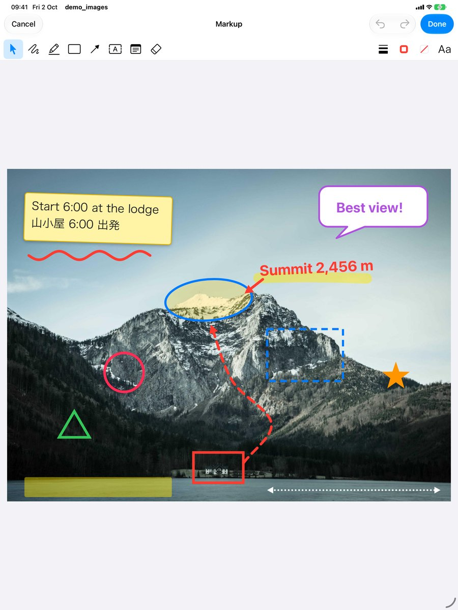
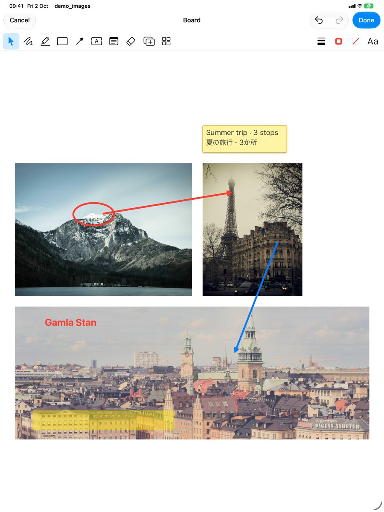

# ImageMarkupKit

Photo markup and multi-photo boards for iOS 15+.

| Annotate a photo | Style panels | Curves and polylines |
|---|---|---|
|  |  |  |

| iPad: one-row toolbar | Board: several photos, attached arrows |
|---|---|
|  |  |

- **Annotate a photo**: pen, highlighter, shapes (rectangle, rounded rectangle, oval, circle, square, triangle,
  diamond, star, pentagon, speech bubble, highlight box), arrows and lines, text, sticky notes, object eraser.
  Every mark is an object: select, move, resize (8 handles), rotate, restyle, duplicate, lock, reorder, undo/redo.
- **Polylines and curves** (in the Arrow button's menu, next to Arrow / Line):
  - *Polyline*: tap (or drag to) each point; tap the last point again, or ✓, to finish; tap the first point to
    close it into a fillable polygon. Undo removes the last point.
  - *Curve*: drag out a line, then drag its middle point to bend it; the curve passes through its points. "+"
    handles between points add more bends (S-curves).
  - Selected polylines and curves: drag any point, "+" to insert one, tap a point then "Delete Point" to remove it,
    Close / Open Shape. Arrowheads are off by default (Shape Style › Arrowheads); ends attach to items like arrows.
  Border (stroke), fill (background) and text (foreground) colors, line width, dash, arrowheads, opacity,
  corner radius, shadow, font family (incl. Hiragino Sans / Mincho), size, bold/italic, alignment.
- **Board**: several photos placed side by side (equal height, 3 per row, in pick order). Drag, resize and rotate
  photos; add more photos later; Arrange (row / column / grid / tidy up). Arrows attach to a point on a photo and
  follow it; marks drawn on a photo are attached to it and move, scale and rotate with it.
- **Export**: one flattened JPEG (or PNG). A single photo exports at its original pixel size; boards export at the
  photos' resolution, capped at 8192 px and 40 MP.
- **Re-editable**: optionally saves a package (JSON + original photos + export) that reopens in the editor.
- Toolbar modelled on macOS Preview's Markup bar: one row under the navigation bar on iPad (regular width),
  two rows at the bottom on iPhone (compact width); style panels are popovers on iPad and sheets on iPhone.

No third-party dependencies. UIKit only.

## Requirements

- iOS 15.0+, Xcode 15+ (`swift-tools-version: 5.9`, Swift 5 language mode).
- Host app Info.plist:
  - `NSCameraUsageDescription` if you use the Camera item of a board's "Add Images" menu.
  - `NSPhotoLibraryAddUsageDescription` if the app (or the share sheet's "Save Image") saves to Photos.
  - Photo picking uses `PHPickerViewController`, which needs no permission.

## Installation

Swift Package Manager: in Xcode, *File › Add Package Dependencies…*, enter
`https://github.com/thnhsng/ImageMarkupKit`, choose *Up to Next Minor Version* from `0.2.0`, then add the
`ImageMarkupKit` library to the app target. Or in `Package.swift`:

```swift
.package(url: "https://github.com/thnhsng/ImageMarkupKit", .upToNextMinor(from: "0.2.0"))
```

Versions follow [Semantic Versioning](https://semver.org) and are git tags; see [CHANGELOG.md](CHANGELOG.md).
Before 1.0, minor versions (0.x) may contain breaking API changes.

## Demo app

`Example/demo_images.xcodeproj` references this package locally (`..`), so library changes show up immediately.
Open it, pick an iPhone or iPad simulator and run the `demo_images` scheme.

The screenshots above come from the demo's scripted scenarios (Debug builds), e.g.
`xcrun simctl launch <device> com.thnhsng.demo-images -demoScenario annotate -demoPanel shapeStyle -demoSelect 1`
(see `Example/demo_images/DemoScenarios.swift`).

## Usage

```swift
import ImageMarkupKit

// 1. Annotate one photo (the file is read, never modified).
let editor = try MarkupEditorViewController(imageURL: photoURL)

// 2. A board from several photos, side by side in this order.
let editor = try MarkupEditorViewController(imageURLs: urls)

// In-memory images (e.g. camera) are encoded once to a session file.
let editor = try MarkupEditorViewController(image: uiImage)

// 3. Reopen a saved package.
let editor = try MarkupEditorViewController(packageURL: packageURL)

var configuration = MarkupEditorConfiguration()
configuration.packageDirectory = appSupport.appendingPathComponent("Markups")   // enables re-editing
configuration.exportOptions = MarkupExportOptions(format: .jpeg(quality: 0.85), maxPixelDimension: 8192)
let editor = try MarkupEditorViewController(imageURLs: urls, configuration: configuration)

editor.delegate = self
present(editor.embeddedInNavigationController(), animated: true)
```

```swift
extension PhotoViewController: MarkupEditorDelegate {
    func markupEditor(_ editor: MarkupEditorViewController, didFinishWith result: MarkupResult) {
        editor.dismiss(animated: true)
        // Attach result.imageData (JPEG) to your record.
        // result.packageURL / result.document + result.assets allow editing it again later.
    }

    func markupEditorDidCancel(_ editor: MarkupEditorViewController) {
        editor.dismiss(animated: true)
    }

    func markupEditor(_ editor: MarkupEditorViewController, didFailWith error: Error) { /* optional */ }
}
```

Photos picked with `PHPickerViewController` are temporary files. Copy them first:

```swift
let picker = PHPickerViewController(configuration: MarkupImageImport.pickerConfiguration())   // multi, ordered
// in picker(_:didFinishPicking:)
let urls = await MarkupImageImport.copyPickerResults(results, to: someFolder)
```

`MarkupResult.image` is the full-size flattened image; prefer `imageData` when you only need to store it
(a 40 MP board decoded in memory is about 160 MB).

### Rendering without the editor

```swift
let rendering = await MarkupRenderer.render(document, assets: catalog)   // off the main thread
rendering.data        // JPEG
rendering.pixelSize
```

## Saved package

```
<document id>.markup/
    document.json       objects, styles, bindings (schemaVersion 1)
    assets/<assetID>    original photos, byte-for-byte (HEIC stays HEIC)
    export.jpg          flattened image
    thumbnail.jpg       512 px preview
```

Saving writes a staging folder and swaps it in atomically; photos no longer used are dropped.
`MarkupPackage.save(_:assets:export:in:)`, `MarkupPackage.load(from:)` and `MarkupPackage.packages(in:)` are public.

### document.json

Coordinates are **canvas units**, independent of photo resolution: in image mode the photo's long edge is 1024
units; on a board photos are placed at a height of 600 units. Export density = photo pixels per unit.

```jsonc
{
  "schemaVersion": 1,
  "id": "…",
  "kind": "image",                    // or "board"
  "backgroundItemID": "…",            // image mode only: the locked background photo
  "backgroundColor": "#FFFFFFFF",
  "items": [                          // z-order, bottom first; photos always below annotations
    { "id": "…", "type": "image",  "content": { "assetID": "….jpg", "pixelSize": [4032, 3024], "box": { "frame": [[0, 0], [1024, 768]], "rotation": 0 } } },
    { "id": "…", "type": "shape",  "content": { "kind": "ellipse", "box": { … }, "lockAspect": false },
      "style": { "strokeColor": "#FF3B30FF", "fillColor": "#FFCC004D", "lineWidth": 6, "dash": "solid", "opacity": 1, "cornerRadius": 0, "shadow": false },
      "parentID": "…" },              // board: the photo this mark is attached to
    { "id": "…", "type": "text",   "content": { "text": "山頂", "font": { "family": "hiraginoSans", "size": 30, "bold": true, "italic": false },
                                                "color": "#FF3B30FF", "alignment": "left", "fixedWidth": 280, "padding": 16, "box": { … } } },
    { "id": "…", "type": "stroke", "content": { "points": [[0, 0.5], …], "box": { … }, "isHighlighter": false } },   // points normalized to the box
    { "id": "…", "type": "line",   "content": { "start": { "point": [x, y], "binding": { "itemID": "…", "anchor": [0.3, 0.8] } },
                                                "end": { "point": [x, y] }, "startHead": "none", "endHead": "arrow" } }
  ]
}
```

- `box.frame` is the unrotated frame; `rotation` is in radians about its center.
- A `binding.anchor` is a normalized point inside the target's unrotated frame; `point` caches the resolved position.
- Colors are sRGB `#RRGGBBAA`. Unknown item types are skipped when decoding, so older apps can open newer files.

## Customization

- `MarkupEditorConfiguration.features` (`MarkupFeatures`): which tools, style buttons, board functions and
  selection actions the editor offers (see below).
- `MarkupEditorConfiguration.styleDefaults` (`StyleDefaults`): colors, widths and fonts of new items.
- `MarkupEditorConfiguration.navigationTexts` (`MarkupNavigationTexts`): titles of the Done and Cancel buttons and
  of the discard-changes alert, e.g. a "Save" button or a translation:

  ```swift
  var texts = MarkupNavigationTexts.english
  texts.done = "Save"
  configuration.navigationTexts = texts
  ```
- The other user-facing strings (tools, menus, panels) are in `UI/Strings.swift` (English); localize there.
- `editor.tool` and `editor.selectedItemIDs` can be set programmatically.
- Programmatic annotations: `MarkupItem.shape(...)`, `.text(...)`, `.stroke(...)`, `.line(...)`, `.connector(...)`,
  then `document.attachAnnotationsToPhotos()` on boards.

### Turning tools off

Ship a `MarkupFeatures.json` in the app and load it (the demo app's `Example/demo_images/MarkupFeatures.json` lists every
name, all on; `MarkupFeatures-minimal.json` is a trimmed example):

```swift
var configuration = MarkupEditorConfiguration()
configuration.features = try MarkupFeatures.fromBundle()   // MarkupFeatures.json in Bundle.main; .all if absent
```

```json
{
  "draw":    { "enabled": true, "items": { "pen": true, "highlighter": false } },
  "shapes":  { "enabled": false },
  "lines":   { "items": { "curve": false } },
  "actions": { "items": { "lock": false } }
}
```

| Group | Items |
|---|---|
| `draw` | `pen`, `highlighter` |
| `shapes` | `rectangle`, `roundedRectangle`, `oval`, `circle`, `square`, `triangle`, `diamond`, `star`, `pentagon`, `speechBubble`, `highlightBox` |
| `lines` | `arrow`, `polyline`, `curve` |
| `text` | `text`, `note` |
| `eraser` | `eraser` |
| `style` | `shapeStyle`, `borderColor`, `fillColor`, `textStyle` |
| `board` | `photoLibrary`, `camera`, `arrange` |
| `actions` | `editText`, `duplicate`, `bringToFront`, `sendToBack`, `lock`, `delete` |

- `"enabled": false` turns off the whole group; an item set to `false` turns off just that item. Missing groups and
  items stay on, so a file only needs what it turns off.
- Unknown names throw `MarkupFeaturesError.unknownKey("draw.items.hightlighter")` and wrong value types
  `.invalidValue("shapes")`, so typos never pass silently. Keys starting with `_` are ignored (use `"_comment"`).
- Turned-off items disappear from the toolbar, menus, action bar and keyboard shortcuts, and `editor.tool` ignores
  them. A menu left with one entry becomes a plain button; the iPhone toolbar drops to one row when no style or
  board buttons remain. Select, undo/redo and pinch zoom are always available (Zoom to Fit is in the Arrange menu,
  so it goes with `arrange`; ⌘0 still works); Unlock stays for already-locked items;
  `editText` only stops re-editing existing text (new text is still typed in place).
- In code: `features.setEnabled(false, .highlighter)`, `features.setEnabled(false, group: .shapes)`;
  `MarkupFeatures.all.jsonData()` produces a complete template.

## Architecture

| Layer | Contents |
|---|---|
| Model | `MarkupDocument`, `MarkupItem`, contents, `ItemStyle` — value types, Codable, Sendable |
| Geometry | Box math, `PathFactory` (all paths), `TextLayout`, hit testing, bindings, attachments, board layout |
| Rendering | `MarkupRenderer` (off-main export), `ImagePipeline` (ImageIO downsampling, cache) |
| Canvas | `UIScrollView` zoom/pan, one view per item (CAShapeLayer, stays sharp when zoomed), screen-space selection overlay |
| Editor | `EditorStore` (state + snapshot undo), interactions (select, draw, shapes, arrows, text, eraser) |
| UI | Toolbar, style panels, photo picking |

Screen and export share `PathFactory` and `TextLayout`, so the exported image matches what is on screen.

## Known limitations (PoC)

- One item selected at a time; no crop; the eraser removes whole objects; connectors are straight.
- Text is edited unrotated; very large fonts on small screens can wrap slightly differently while editing.
- iOS 15 availability is enforced at compile time; runtime behavior on iOS 15 still needs a device check.

## Credits

The overall approach draws on ideas from [Drawsana](https://github.com/Asana/Drawsana) by Asana (MIT):
Codable shapes dispatched by type, an operation-based undo stack, an immediate single-touch recognizer and
quadratic-midpoint pen smoothing. The code here is an independent implementation built around per-object layers,
zooming and a board model.

Sample photos in `Example/demo_images/SamplePhotos/` are from [Unsplash](https://unsplash.com) under the
[Unsplash License](https://unsplash.com/license) (not MIT):
[mountain lake](https://unsplash.com/photos/TI-B-TNYJMU) by Paul E. Harrer,
[Paris](https://unsplash.com/photos/_py5wlZTI2c) by Laura Liberal,
[Stockholm](https://unsplash.com/photos/eVBg7A07NGg),
[New York](https://unsplash.com/photos/hfIheOEJp9M) by Namphuong Van.

## License

MIT. See [LICENSE](LICENSE).
